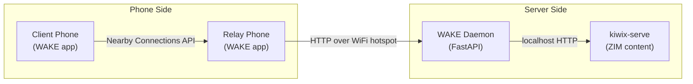

# WAKE — Revised Project Roadmap

## Core Philosophy Change

The original roadmap builds BLE advertising, BLE scanning, WiFi Direct group negotiation, and GATT servers from scratch — 4 of the 9 phases. The new roadmap replaces all of that with a single library: **Google Nearby Connections API**. Everything else (kiwix-serve, Room, Tink, FastAPI) stays the same or gets simplified.

## Architecture Overview




- **Phone-to-phone**: Nearby Connections API (auto-selects WiFi Direct / BLE / BT Classic)
- **Phone-to-server**: HTTP over local WiFi or Pi hotspot (no Nearby needed)
- **Server**: Python FastAPI + kiwix-serve on laptop (dev) → Pi (production)

---

## Phase 0 — Environment Setup (Week 1)

**Needs: laptop only**

- Install kiwix-serve; download **English Wikipedia Top Mini** ZIM (`wikipedia_en_top_mini_2026-03.zim`, ~315 MB). Avoid `wikipedia_en_simple_all_mini` — broken builds.
- Verify kiwix-serve REST API: `GET /search?pattern=...` returns search results HTML; articles at `GET /A/Article_Name`
- Install Android Studio, create a blank Kotlin + Jetpack Compose project, verify build succeeds
- Goal: see kiwix content in a browser by end of week

**Key files/tools:** `kiwix-serve`, Android Studio, Python 3.11+

---

## Phase 1 — Python Server Daemon (Weeks 1–4)

**Needs: laptop only**

Build the **WAKE Gateway Daemon** — a FastAPI app that sits in front of kiwix-serve and speaks the WAKE bundle protocol.

- **Bundle format**: Start with **JSON + base64** (not CBOR). Readable, debuggable, no new libraries. Migrate to CBOR only if size becomes a real problem.
  - Request bundle: `{node_id, query_id, query_string, timestamp, ttl_seconds, hop_count, signature}`
  - Response bundle: `{server_id, query_id, chunk_index, total_chunks, content_type, payload_b64, sha256, signature}`
- **kiwix proxy logic** (two request types, same bundle protocol):
  - **Search**: `query_string` is a search term → daemon calls `GET /search?pattern={query_string}` on kiwix-serve → returns search results HTML as the bundle payload. Results contain article links of the form `/A/Article_Title`.
  - **Article fetch**: `query_string` is a kiwix article path (e.g. `/A/Water`) → daemon calls `GET /A/Water` on kiwix-serve → returns full article HTML as the bundle payload.
  - The daemon distinguishes the two by checking whether `query_string` starts with `/` (article path) or not (search term).
- **SQLite queue** (`aiosqlite`): tables for `inbound_requests`, `outbound_bundles`, `seen_bundle_ids`
- **Chunker**: split large HTML/image responses into ~100 KB chunks, each chunk is a separate JSON bundle file
- **Signing**: `PyNaCl` Ed25519 keypair generated once, stored on disk. Sign every outbound bundle. Expose public key at `GET /pubkey`
- **HTTP endpoints** (for phones to call over WiFi):
  - `POST /request` — receive a request bundle from a phone
  - `GET /pending?node_id=...` — phone polls for response bundles addressed to it
  - `GET /bundle/{bundle_id}` — fetch a specific bundle file

**Key libraries:** `fastapi`, `uvicorn`, `aiosqlite`, `pynacl`, `httpx`

**Phase 1 notes:**
- Project skeleton includes `requirements.txt` with pinned versions
- `node_id` is a UUID for Phase 1 testing; Android Keystore identity deferred to Phase 5
- Two request types distinguished by `query_string` prefix: plain text = search, `/A/...` path = article fetch

---

## Phase 2 — Android App + Direct Server Link (Weeks 3–7)

**Needs: 1 phone + laptop on same WiFi**

Build the Android app and get a full end-to-end working — search query flows from phone to server over local WiFi, content comes back and renders. No DTN yet.

- **Foreground Service**: keeps the app alive; handles all network operations. Mandatory for background operation
- **Room DB schema**: `bundles` table (id, query_id, type, chunk_idx, total_chunks, payload_path, ttl_expires_at, status), `seen_ids` table
- **Bundle store manager**: Kotlin class; writes payloads as files in `filesDir`, metadata to Room; LRU eviction when storage cap exceeded (default 500 MB)
- **HTTP client** (OkHttp): phone POSTs a request bundle to `{server_ip}/request`, then polls `GET /pending?node_id=...` every 10s until all chunks arrive
- **Chunk reassembly**: when all `total_chunks` are present in Room for a `query_id`, reassemble payload bytes in chunk_index order
- **UI (Jetpack Compose)**:
  - Search screen: text field + search button + results list rendered from search HTML
  - Status screen: storage used, last sync time
  - Result screen: `WebView` rendering reassembled article HTML. Override `shouldOverrideUrlLoading` to intercept `/A/...` link taps and fire a new WAKE bundle request instead of navigating directly to kiwix-serve.
- **Signing verification**: use `Tink` (Android) to verify Ed25519 signatures from server before accepting any bundle

**Key libraries:** `Room`, `OkHttp`, `Jetpack Compose`, `Google Tink`

---

## Phase 3 — Nearby Connections API Transport (Weeks 6–10)

**Needs: 2 phones** (borrow one for this phase)

Replace the WiFi HTTP polling with the Nearby Connections API for phone-to-phone bundle exchange. This is the entire BLE + WiFi Direct problem solved with one dependency.

**Add to `build.gradle`:**

```kotlin
implementation("com.google.android.gms:play-services-nearby:19.1.0")
```

- **Discovery**: call `Nearby.getConnectionsClient(context).startAdvertising(...)` and `startDiscovery(...)` with a WAKE service ID string (`"com.wake.dtn"`). Nearby handles BLE advertising and scanning automatically
- **Connection lifecycle**: implement `ConnectionLifecycleCallback` — `onConnectionInitiated`, `onConnectionResult`, `onDisconnected`. Accept all WAKE peer connections automatically
- **Manifest exchange**: on connection, send your bundle manifest (list of `{query_id, chunk_index}` you hold) as a `Payload.fromBytes(...)`. Receive theirs
- **Bundle transfer**: diff the two manifests, send missing bundles as `Payload.fromFile(...)` (Nearby streams the file directly — no memory pressure)
- **Epidemic routing** (Phase 3a, start here): forward every bundle you hold to every new peer you meet. Simple flood-fill. This is your default routing mode
- **Deduplication**: check `seen_ids` Room table before forwarding; insert after forwarding

**What Nearby replaces from the original roadmap:**

- All of Phase 4 (BLE Advertiser, BLE Scanner, GATT server/client)
- All of Phase 5 (WifiP2pManager, NanoHTTPD transfer server, OkHttp transfer client, session lifecycle, WiFi disconnect handling)

---

## Phase 4 — PRoPHET Routing Upgrade (Weeks 9–12)

**Needs: 2 phones**

Upgrade from epidemic routing (flood-fill) to **PRoPHET routing** — only forward a bundle to a neighbor if they have higher delivery probability to the destination than you do.

- Add `routing_table` to Room: `(node_id, destination_id, delivery_prob REAL, last_updated INTEGER)`
- On each Nearby connection: exchange routing tables as part of the manifest exchange
- **PRoPHET update formulas** (implement in a ~200-line `ProphetRouter.kt`):
  - Direct contact: `P(A→B) = P_old + (1 - P_old) × 0.75`
  - Transitivity: `P(A→C) = P_old(A→C) + (1 - P_old(A→C)) × P(A→B) × P(B→C) × 0.25`
  - Aging: `P = P_old × 0.98^k` (k = time units since last update)
- **Forwarding decision**: only push bundle to neighbor if `neighbor.P(→dst) > self.P(→dst)`. Server advertises `P = 1.0` to itself
- TTL enforcement: check `ttl_expires_at` before forwarding; drop expired bundles

---

## Phase 5 — Security Hardening (Weeks 11–13)

**Needs: 1 phone**

Most of this is already stubbed in Phase 2 (Tink + signing). Harden and complete it.

- **Node identity**: on first launch, generate Ed25519 keypair in **Android Keystore** (hardware-backed). The public key IS the node_id. Never leaves the secure enclave
- **Request signing**: client signs outbound request bundles with its Keystore key. Server verifies before processing
- **Relay verification**: relay nodes verify server signature before caching a response bundle — prevents content poisoning
- **Optional (if privacy matters)**: encrypt request payload with server's X25519 public key using Tink's `HybridEncrypt`. Only the server can read the query string

---

## Phase 6 — Pi Deployment + Field Testing (Weeks 12–14)

**Needs: 1 phone + Raspberry Pi**

Move the server from laptop to Pi. Test the full DTN path.

- Deploy WAKE daemon + kiwix-serve on Pi as systemd services
- Configure Pi as a **WiFi hotspot** (`hostapd` + `dnsmasq`): Pi broadcasts SSID `WAKE-Server`, phones connect to it when physically near
- Phone-to-Pi: same HTTP polling protocol from Phase 2, just pointed at Pi IP (`192.168.4.1`)
- **Field test sequence**:
  1. Phone directly connected to Pi hotspot → query works end-to-end
  2. Phone out of Pi range → submit query → walk back into range → response delivered
  3. Two phones: Client submits query, Relay phone carries it to Pi, response routed back (need 2 phones here)
- Battery optimization: switch Nearby to `STRATEGY_CLUSTER` (low-power periodic scan) when idle; `STRATEGY_P2P_STAR` only when actively exchanging

---

## What Was Eliminated vs. Original

- Phase 4 (BLE from scratch) — **replaced by Nearby Connections API**
- Phase 5 (WiFi Direct from scratch) — **replaced by Nearby Connections API**
- CBOR serialization — **replaced by JSON** (simpler, revisit if bandwidth matters)
- GATT server for manifest exchange — **replaced by Nearby `Payload.fromBytes`**
- Pi-first constraint — **replaced by laptop-first** (Pi in final phase only)
- 3-phone requirement for first test — **2 phones, deferred to Phase 3**
- ~16 weeks of original scope — **eliminated**
